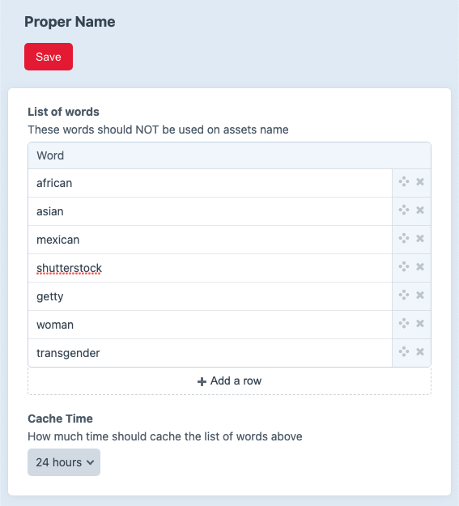

# Proper Name plugin for Craft 3

Proper Name is a Craft 3 plugin intended to reduce liability and improve SEO by preventing biased (gender, ethnicity...) and/or copyrighted (shutterstock, getty...) assets naming and upload.



---

## Installation

From your Craft project:

```bash
composer require leowebguy/craft-proper-name
```

In the Control Panel, go to Settings → Plugins → "Proper Name" → Install
