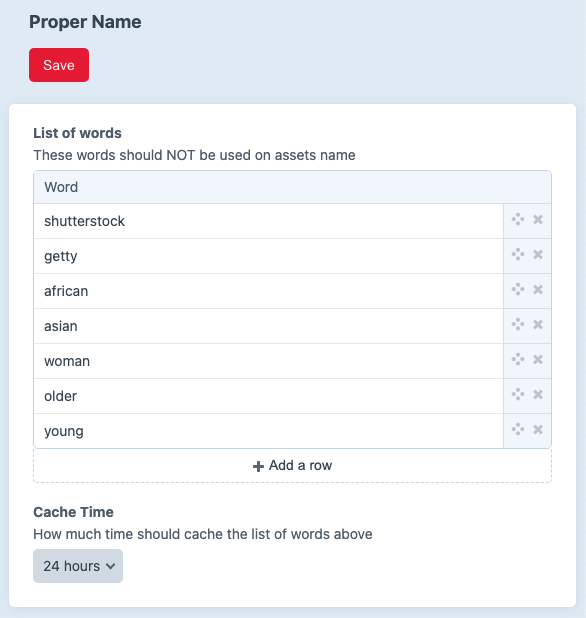

Proper Name plugin for Craft 3
===

Proper Name is a Craft 3 plugin intended to reduce liability and improve SEO by preventing biased (gender, ethnicity...) and/or copyrighted (shutterstock, getty...) and other not desired/recommended assets naming.



---

## Installation

From your Craft project:

```bash
composer require leowebguy/proper-name
```

In the Control Panel, go to Settings → Plugins → "Proper Name" → Install

## Testing

Follow [these](https://craftcms.com/docs/3.x/testing/testing-craft/setup.html) steps to setup Codeception then symlink the main file `vendor/leowebguy/proper-name/tests/unit/ProperNameTest.php` into `tests/unit/` folder executing the command below from your project root.

```bash
ln -s ../../vendor/leowebguy/proper-name/tests/unit/ProperNameTest.php ./tests/unit/ProperNameTest.php;
```

Then run `php vendor/bin/codecept run unit` from your root


