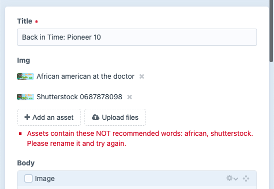
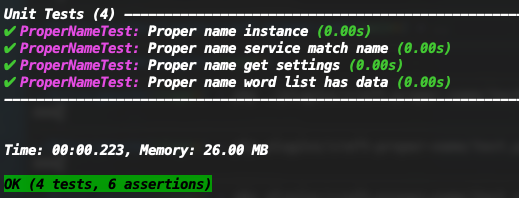

Proper Name
===

Proper Name is a Craft CMS plugin intended to reduce liability and improve SEO by preventing biased (gender, ethnicity...), copyrighted (shutterstock, getty...) and other non desired naming.

### Installation

```bash
composer require leowebguy/proper-name
```

On your Control Panel, go to Settings → Plugins → "Proper Name" → Install

### Settings

Set words that you would prefer NOT to be used in assets naming.


### Output error



## Testing

If you have [Codeception](https://craftcms.com/docs/3.x/testing/testing-craft/setup.html) already setup, use the following command to symlink the plugin test file `vendor/leowebguy/proper-name/tests/unit/ProperNameTest.php` into `tests/unit/` folder.

```bash
ln -s ../../vendor/leowebguy/proper-name/tests/unit/ProperNameTest.php ./tests/unit/ProperNameTest.php;
```

Then run `php vendor/bin/codecept run unit` from your root


